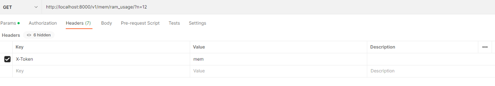

# RAM Usage Monitoring

# Run Service

for running service there two option that depends on your requirements

first of all there is environment file, in .env file we got `LOCAL_EXECUTOR` which is `false` mainly.

`LOCAL_EXECUTOR` while changing to `true` that means service working with threading.timer

.env
```.env
LOCAL_EXECUTOR=true
```

otherwise service will running with `celery beat` and `celery worker`, behind celery `redis` and `flower` added.
<details>
- Flower is celery dashboard and monitoring
- Redis will working as message broker and result backend(but in this service we will clear celery keys for keep memory clean)

</details>

now we setting up celery configs like `sample.env`

after settings up we running `docker-compose.yaml`

```bash
docker-compose up -d
```
`-d` means detach and working in background

<details>
We already using bash script for running celery and main file parallel

in this case we comparing `LOCAL_EXECUTOR` in if condition like below bashscript

```bash
#!/bin/bash
# Load environment variables from .env file
if [ -f .env ]; then
  local=$(cat .env | grep LOCAL | cut -d '=' -f2 | tr -d '[:space:]')
fi;

if [[ "$local" == "true" ]]; then
    # If local_executioner is true, run main.py
    echo "None celery scheduler running"
    python main.py
else
    # If local_executioner is false or not set, run celery commands
    echo "celery scheduler running"
    python main.py &
    celery -A src.scheduler.tasks beat -l INFO &
    celery -A src.scheduler.tasks worker --loglevel=INFO --concurrency=2
fi
```
in this script we checking `LOCAL_EXECUTOR` if was `true` that means working on threading
otherwise working on `celery`.
</details>


### Sample request




# Database

in this case we are using sqlite and sqlalchemy v2 

for handle idle sessions and make sure session works well we created singleton connection

at the end of creations we made:
- `contextmanager` for open session
- `get db` as generator to use session
- `init db` to create models

[Database](https://gitlab.com/ashkangoleh/system-memory-usage-monitoring/-/blob/develop/src/db/database.py)


# Model

for creating model we used declarative base class.
in model we used required fields include `created_at`.

[Model](https://gitlab.com/ashkangoleh/system-memory-usage-monitoring/-/blob/develop/src/model/system_ram_usage.py)

also we created Query builders with existing model to make it clear

[Model Service](https://gitlab.com/ashkangoleh/system-memory-usage-monitoring/-/blob/develop/src/model/repository/mem_service.py)


# Routers

Next level is create routers to retrieve data from database and used fastapi routers

[Routers](https://gitlab.com/ashkangoleh/system-memory-usage-monitoring/-/blob/develop/src/routers/memory_routers.py) got prefix path as `/mem` and main route as `GET` method which named `get_last_ram_usage_info` and path `/ram_usage/`

# Schemas

for handling all environments we already using `BaseSettings` from `pydantic` module

[BaseSettings Schema](https://gitlab.com/ashkangoleh/system-memory-usage-monitoring/-/blob/develop/src/schemas/settings_schema.py)

# Settings

in this folder we implemented [custom middleware](https://gitlab.com/ashkangoleh/system-memory-usage-monitoring/-/blob/develop/src/settings/middleware.py) to handle cors origin and custom header validation.
<details>

```python
class CustomMiddleware:
    ORIGINS = [
        "*"
        ]

    def __init__(self, app) -> None:
        self.app = app

    async def verify_api_key(self, request: Request):
        api_key = request.headers.get('X-Token')
        if api_key != settings.API_TOKEN:
            raise HTTPException(
                detail="Invalid API KEY",
                status_code=status.HTTP_400_BAD_REQUEST
                )
            
    def cors_origins(self):
        self.app.add_middleware(
            CORSMiddleware,
            allow_origins=self.ORIGINS,
            allow_credentials=True,
            allow_methods=["*"],
            allow_headers=["*"],
            )
```
`verify_api_key` function getting whole http requests and checking validate `api_key` and handle it from request (it's a simple securing routes)

`corse_origins` will handle incoming requests and check methods and headers (looks like conversion between back-end and front-end)

</details>

# Scheduler

in this case what we said in top content we are using two phase `LOCAL_EXECUTOR` and `Celery`, this scheduler is specific for Celery which has [config.py](https://gitlab.com/ashkangoleh/system-memory-usage-monitoring/-/blob/develop/src/scheduler/config.py) and [tasks.py](https://gitlab.com/ashkangoleh/system-memory-usage-monitoring/-/blob/develop/src/scheduler/tasks.py)

in `config.py` we are handle configuration of celery implement include celery beat (like [Airflow](https://airflow.apache.org/))
and in `tasks.py` creating tasks to run in background 

to run this step we have two different command:
- run Celery Beat 
```bash   
celery -A src.scheduler.tasks beat -l INFO
```
- run Celery Workers
```bash   
celery -A src.scheduler.tasks worker --loglevel=INFO --concurrency=2
```
celery beat will send task to worker in every minutes(on demand)


# Utils

we implemented [ram usage script](https://gitlab.com/ashkangoleh/system-memory-usage-monitoring/-/blob/develop/src/utils/get_ram_usage.py) which checking system ram usage and saving into database.

in this case we used [unit convertor](https://gitlab.com/ashkangoleh/system-memory-usage-monitoring/-/blob/develop/src/utils/decorators/unit_convertor.py) decorator to convert incoming values as GB or MB.


# Service Folder Tree

```bash
.
├── Dockerfile
├── README.md
├── docker-compose.yaml
├── entrypoint.sh
├── main.py
├── requirements.txt
├── sample.env
├── src
│   ├── db
│   │   ├── __init__.py
│   │   └── database.py
│   ├── model
│   │   ├── __init__.py
│   │   ├── repository
│   │   │   └── mem_service.py
│   │   └── system_ram_usage.py
│   ├── routers
│   │   ├── __init__.py
│   │   └── memory_routers.py
│   ├── scheduler
│   │   ├── config.py
│   │   └── tasks.py
│   ├── schemas
│   │   ├── __init__.py
│   │   ├── ram_schema.py
│   │   └── settings_schema.py
│   ├── settings
│   │   ├── __init__.py
│   │   └── middleware.py
│   ├── test
│   └── utils
│       ├── __init__.py
│       ├── decorators
│       │   ├── __init__.py
│       │   └── unit_convertor.py
│       └── get_ram_usage.py
└── storage
```

